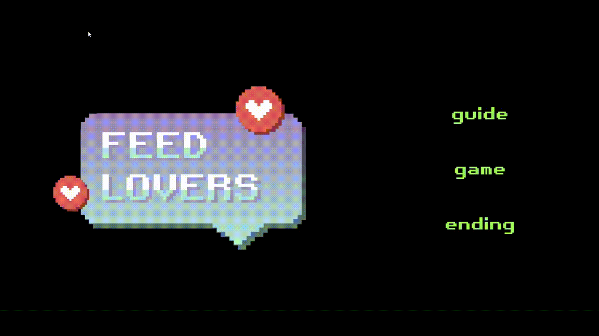

## Abstract

You can play this game [here](https://kadiace.github.io/2023F_CS489_FeedLovers).



> Hello, you are **Feed**, developed for our platform's **_content recommendation algorithm_**.

## How To Play

- To survive, you should reach the goal of each **Round**.
- You get 16 consumers and 12 contents for each **Wave**.
- You play a simple **matching game** every wave.
- Pick up the contents right, and drop them to the appropriate consumer left.
- You get $100 per one successful matching.
- **That's all!** Thank you for enjoying this project!

## Environment

```bash
$ node -v
> v18.17.1

$ npm -v
> 9.6.7
```

## Available Scripts

After clone this repository, in the project directory:

### `npm install --legacy-peer-deps`

Then you can run the project with this command:

### `npm run start`

When you activate this project at local, port is set to 3000 by default.

---

```
This is toy project for KAIST CS489, 2023F.
```
